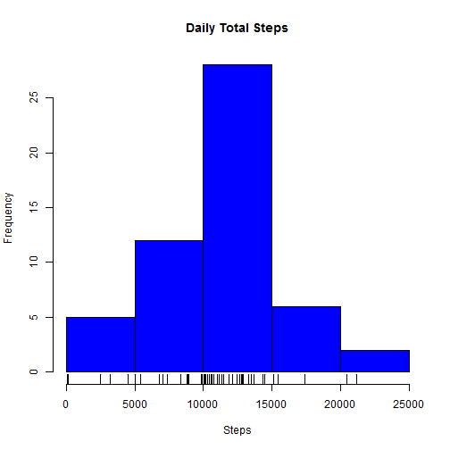
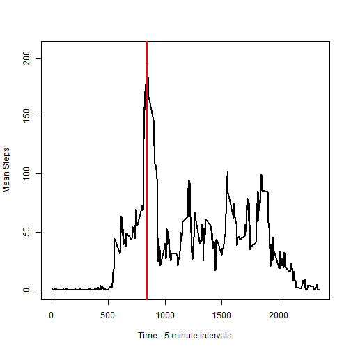
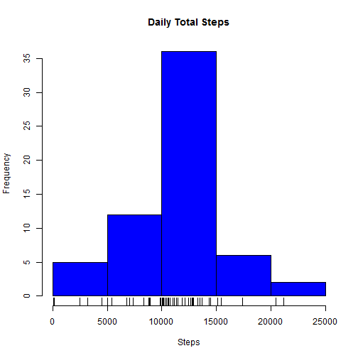
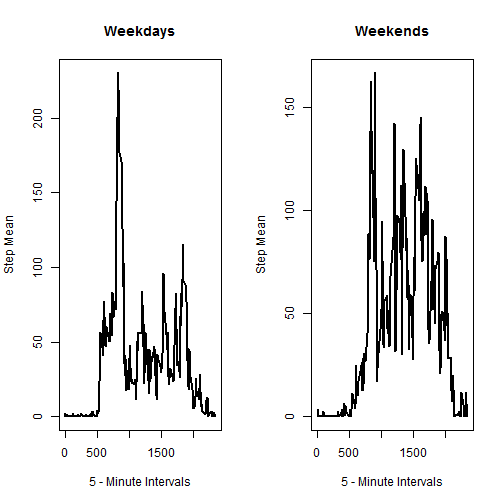

# Reproducible Research: Peer Assessment 1

This is the first peer reviewed assignment for the Reproducible Research Coursera course. The data was provided in a zipped format from the repo created by **rdpeng** and will be unzipped and pulled into r.

Set the working directory.

```r
setwd("p://RepData_PeerAssessment1/")
```

## Loading and preprocessing the data

This project includes an instructor provided data set. Prior to using this data set it must be unzipped and placed in a new file. To unzip the file I have used the command $unzip("./activity.zip",exdir="./data")$.

The unzipped file is imported into R so that data processing can begin.


```r
DTA<-read.csv("./data/activity.csv")
```
The data is processed using three steps

1. Construct a new column for the data frame that identifies the complete cases.
2. Construct a subset of the original data frame containing only complete cases.
3. Calculate some summary statistics with the subsetted data frame.

The complete cases are identified using

```r
DTA$CC<-complete.cases(DTA)
DTA$Count<-1
CO<-function(X){
        n<-length(X[[1]])
        for(i in 1:n){
                t<-i%%288
                X$Count[[i]]<-t
        }
        return(X)
}
DTA<-CO(DTA)
DTA$Date<-as.Date(DTA$date)
DTA$Weekday<-weekdays(DTA$Date,abbreviate=FALSE)
```
Subsetting to eliminate incomplete cases is done using

```r
DTA2<-DTA[DTA$CC==TRUE,]
```
An interesting question is; how many steps are taken per day? To answer this question I've constructed another data frame summarizing the number of steps taken per day.

```r
library(plyr)
DTATotal<-ddply(DTA2,.(date),summarize,sum=sum(steps))
```
The sum of the steps taken each day is summarized in the following histogram.

```r
hist(DTATotal$sum,col="blue", main="Daily Total Steps",xlab="Steps")
rug(DTATotal$sum)
```

 

## What is mean total number of steps taken per day?
The question of this heading could be interpreted in two ways.

1. What are the mean and median number of steps taken per day?
2. What are the mean and median number of steps taken across each day?

The answer to the first question is presented in the following table.

```r
library(xtable)
summary<-ddply(DTA2,.(date),summarize,mean=mean(steps),med=median(steps))
xt<-xtable(summary)
print(xt,type="html")
```

<!-- html table generated in R 3.1.1 by xtable 1.7-3 package -->
<!-- Thu Aug 14 10:47:41 2014 -->
<TABLE border=1>
<TR> <TH>  </TH> <TH> date </TH> <TH> mean </TH> <TH> med </TH>  </TR>
  <TR> <TD align="right"> 1 </TD> <TD> 2012-10-02 </TD> <TD align="right"> 0.44 </TD> <TD align="right"> 0.00 </TD> </TR>
  <TR> <TD align="right"> 2 </TD> <TD> 2012-10-03 </TD> <TD align="right"> 39.42 </TD> <TD align="right"> 0.00 </TD> </TR>
  <TR> <TD align="right"> 3 </TD> <TD> 2012-10-04 </TD> <TD align="right"> 42.07 </TD> <TD align="right"> 0.00 </TD> </TR>
  <TR> <TD align="right"> 4 </TD> <TD> 2012-10-05 </TD> <TD align="right"> 46.16 </TD> <TD align="right"> 0.00 </TD> </TR>
  <TR> <TD align="right"> 5 </TD> <TD> 2012-10-06 </TD> <TD align="right"> 53.54 </TD> <TD align="right"> 0.00 </TD> </TR>
  <TR> <TD align="right"> 6 </TD> <TD> 2012-10-07 </TD> <TD align="right"> 38.25 </TD> <TD align="right"> 0.00 </TD> </TR>
  <TR> <TD align="right"> 7 </TD> <TD> 2012-10-09 </TD> <TD align="right"> 44.48 </TD> <TD align="right"> 0.00 </TD> </TR>
  <TR> <TD align="right"> 8 </TD> <TD> 2012-10-10 </TD> <TD align="right"> 34.38 </TD> <TD align="right"> 0.00 </TD> </TR>
  <TR> <TD align="right"> 9 </TD> <TD> 2012-10-11 </TD> <TD align="right"> 35.78 </TD> <TD align="right"> 0.00 </TD> </TR>
  <TR> <TD align="right"> 10 </TD> <TD> 2012-10-12 </TD> <TD align="right"> 60.35 </TD> <TD align="right"> 0.00 </TD> </TR>
  <TR> <TD align="right"> 11 </TD> <TD> 2012-10-13 </TD> <TD align="right"> 43.15 </TD> <TD align="right"> 0.00 </TD> </TR>
  <TR> <TD align="right"> 12 </TD> <TD> 2012-10-14 </TD> <TD align="right"> 52.42 </TD> <TD align="right"> 0.00 </TD> </TR>
  <TR> <TD align="right"> 13 </TD> <TD> 2012-10-15 </TD> <TD align="right"> 35.20 </TD> <TD align="right"> 0.00 </TD> </TR>
  <TR> <TD align="right"> 14 </TD> <TD> 2012-10-16 </TD> <TD align="right"> 52.38 </TD> <TD align="right"> 0.00 </TD> </TR>
  <TR> <TD align="right"> 15 </TD> <TD> 2012-10-17 </TD> <TD align="right"> 46.71 </TD> <TD align="right"> 0.00 </TD> </TR>
  <TR> <TD align="right"> 16 </TD> <TD> 2012-10-18 </TD> <TD align="right"> 34.92 </TD> <TD align="right"> 0.00 </TD> </TR>
  <TR> <TD align="right"> 17 </TD> <TD> 2012-10-19 </TD> <TD align="right"> 41.07 </TD> <TD align="right"> 0.00 </TD> </TR>
  <TR> <TD align="right"> 18 </TD> <TD> 2012-10-20 </TD> <TD align="right"> 36.09 </TD> <TD align="right"> 0.00 </TD> </TR>
  <TR> <TD align="right"> 19 </TD> <TD> 2012-10-21 </TD> <TD align="right"> 30.63 </TD> <TD align="right"> 0.00 </TD> </TR>
  <TR> <TD align="right"> 20 </TD> <TD> 2012-10-22 </TD> <TD align="right"> 46.74 </TD> <TD align="right"> 0.00 </TD> </TR>
  <TR> <TD align="right"> 21 </TD> <TD> 2012-10-23 </TD> <TD align="right"> 30.97 </TD> <TD align="right"> 0.00 </TD> </TR>
  <TR> <TD align="right"> 22 </TD> <TD> 2012-10-24 </TD> <TD align="right"> 29.01 </TD> <TD align="right"> 0.00 </TD> </TR>
  <TR> <TD align="right"> 23 </TD> <TD> 2012-10-25 </TD> <TD align="right"> 8.65 </TD> <TD align="right"> 0.00 </TD> </TR>
  <TR> <TD align="right"> 24 </TD> <TD> 2012-10-26 </TD> <TD align="right"> 23.53 </TD> <TD align="right"> 0.00 </TD> </TR>
  <TR> <TD align="right"> 25 </TD> <TD> 2012-10-27 </TD> <TD align="right"> 35.14 </TD> <TD align="right"> 0.00 </TD> </TR>
  <TR> <TD align="right"> 26 </TD> <TD> 2012-10-28 </TD> <TD align="right"> 39.78 </TD> <TD align="right"> 0.00 </TD> </TR>
  <TR> <TD align="right"> 27 </TD> <TD> 2012-10-29 </TD> <TD align="right"> 17.42 </TD> <TD align="right"> 0.00 </TD> </TR>
  <TR> <TD align="right"> 28 </TD> <TD> 2012-10-30 </TD> <TD align="right"> 34.09 </TD> <TD align="right"> 0.00 </TD> </TR>
  <TR> <TD align="right"> 29 </TD> <TD> 2012-10-31 </TD> <TD align="right"> 53.52 </TD> <TD align="right"> 0.00 </TD> </TR>
  <TR> <TD align="right"> 30 </TD> <TD> 2012-11-02 </TD> <TD align="right"> 36.81 </TD> <TD align="right"> 0.00 </TD> </TR>
  <TR> <TD align="right"> 31 </TD> <TD> 2012-11-03 </TD> <TD align="right"> 36.70 </TD> <TD align="right"> 0.00 </TD> </TR>
  <TR> <TD align="right"> 32 </TD> <TD> 2012-11-05 </TD> <TD align="right"> 36.25 </TD> <TD align="right"> 0.00 </TD> </TR>
  <TR> <TD align="right"> 33 </TD> <TD> 2012-11-06 </TD> <TD align="right"> 28.94 </TD> <TD align="right"> 0.00 </TD> </TR>
  <TR> <TD align="right"> 34 </TD> <TD> 2012-11-07 </TD> <TD align="right"> 44.73 </TD> <TD align="right"> 0.00 </TD> </TR>
  <TR> <TD align="right"> 35 </TD> <TD> 2012-11-08 </TD> <TD align="right"> 11.18 </TD> <TD align="right"> 0.00 </TD> </TR>
  <TR> <TD align="right"> 36 </TD> <TD> 2012-11-11 </TD> <TD align="right"> 43.78 </TD> <TD align="right"> 0.00 </TD> </TR>
  <TR> <TD align="right"> 37 </TD> <TD> 2012-11-12 </TD> <TD align="right"> 37.38 </TD> <TD align="right"> 0.00 </TD> </TR>
  <TR> <TD align="right"> 38 </TD> <TD> 2012-11-13 </TD> <TD align="right"> 25.47 </TD> <TD align="right"> 0.00 </TD> </TR>
  <TR> <TD align="right"> 39 </TD> <TD> 2012-11-15 </TD> <TD align="right"> 0.14 </TD> <TD align="right"> 0.00 </TD> </TR>
  <TR> <TD align="right"> 40 </TD> <TD> 2012-11-16 </TD> <TD align="right"> 18.89 </TD> <TD align="right"> 0.00 </TD> </TR>
  <TR> <TD align="right"> 41 </TD> <TD> 2012-11-17 </TD> <TD align="right"> 49.79 </TD> <TD align="right"> 0.00 </TD> </TR>
  <TR> <TD align="right"> 42 </TD> <TD> 2012-11-18 </TD> <TD align="right"> 52.47 </TD> <TD align="right"> 0.00 </TD> </TR>
  <TR> <TD align="right"> 43 </TD> <TD> 2012-11-19 </TD> <TD align="right"> 30.70 </TD> <TD align="right"> 0.00 </TD> </TR>
  <TR> <TD align="right"> 44 </TD> <TD> 2012-11-20 </TD> <TD align="right"> 15.53 </TD> <TD align="right"> 0.00 </TD> </TR>
  <TR> <TD align="right"> 45 </TD> <TD> 2012-11-21 </TD> <TD align="right"> 44.40 </TD> <TD align="right"> 0.00 </TD> </TR>
  <TR> <TD align="right"> 46 </TD> <TD> 2012-11-22 </TD> <TD align="right"> 70.93 </TD> <TD align="right"> 0.00 </TD> </TR>
  <TR> <TD align="right"> 47 </TD> <TD> 2012-11-23 </TD> <TD align="right"> 73.59 </TD> <TD align="right"> 0.00 </TD> </TR>
  <TR> <TD align="right"> 48 </TD> <TD> 2012-11-24 </TD> <TD align="right"> 50.27 </TD> <TD align="right"> 0.00 </TD> </TR>
  <TR> <TD align="right"> 49 </TD> <TD> 2012-11-25 </TD> <TD align="right"> 41.09 </TD> <TD align="right"> 0.00 </TD> </TR>
  <TR> <TD align="right"> 50 </TD> <TD> 2012-11-26 </TD> <TD align="right"> 38.76 </TD> <TD align="right"> 0.00 </TD> </TR>
  <TR> <TD align="right"> 51 </TD> <TD> 2012-11-27 </TD> <TD align="right"> 47.38 </TD> <TD align="right"> 0.00 </TD> </TR>
  <TR> <TD align="right"> 52 </TD> <TD> 2012-11-28 </TD> <TD align="right"> 35.36 </TD> <TD align="right"> 0.00 </TD> </TR>
  <TR> <TD align="right"> 53 </TD> <TD> 2012-11-29 </TD> <TD align="right"> 24.47 </TD> <TD align="right"> 0.00 </TD> </TR>
   </TABLE>
The answer to the second question takes less space.

```r
tmean<-mean(DTA2$steps)
tmedian<-median(DTA2$steps)
```
The mean is 37.3826 and the median is 0.

## What is the average daily activity pattern?
Another interesting question answered by this data is during what five minute interval, on average, does this person take their most steps?

```r
summary2<-ddply(DTA2,.(interval),summarize,mean=mean(steps))
```
A picture of this data would help identify the point during a day when this person takes the most steps, on average.

```r
mx<-max(summary2$mean)
dt<-summary2[summary2$mean==mx,]
plot(summary2$interval,summary2$mean,type="l",xlab="Time - 5 minute intervals",ylab="Mean Steps",lwd=2)
abline(v=dt[[1]][[1]], col="red",lwd=3)
```

 

where 835; i.e., 8:35 AM, is the time of day when the most steps are taken, on average.

## Imputing missing values
The original data has missing values. 

```r
NAsum<-sum(is.na(DTA$steps))
```

The number of missing values is 2304.


```r
summary2$Count<-1
summary2<-CO(summary2)
summary2[[3]][[288]]<-288
g<-function(x){
        n<-length(summary2[[1]])#This function finds a mean value for a given 5-minute time interval
        for(i in 1:n){
                t<-summary2[[3]][[i]]
                if(t==x){
                        avg<-summary2[t:t,]
                        break
                }
        }
        return(avg[[2]])
}
fix<-function(X){
        n<-length(X[[1]]) #This function is replacing the NAs in a data set, specifically the DTA data set
        for(i in 1:n){   #The function is not general, but specific to this problem
                t<-X[[1]][[i]]
                if(is.na(t)){
                        c<-X[[5]][[i]]
                        if(c==0){
                                c<-288
                        }
                        X[[1]][[i]]<-g(c)
                }
        }
        return(X)
}
DTA3<-fix(DTA) #This is a new data frame with the NAs replaced
summary<-ddply(DTA3,.(date),summarize,sum=sum(steps))
```
After replacing the NAs in the original data set we can reconstruct the histogram showing the average number of steps per day.


```r
hist(summary$sum,col="blue", main="Daily Total Steps",xlab="Steps")
rug(summary$sum)
```

 

After this transformation of the data the overall mean and median are recalculated as

```r
omean<-mean(DTA3$steps)
omed<-median(DTA3$steps)
```
producing a mean of 37.3826 and median 0, compared to the original data's mean 37.3826 and median 0. As you can see the transformation performed here did not affect the overall measures of central tendency. However, as can be seed in the histograms the absolute frequencies are different for the original data series and the modified series.


```r
 wd<-function(DAY){
     wd<-c("Monday","Tuesday","Wednesday","Thursday","Friday")
     t<-DAY %in% wd
     if(t){
         out<-"Weekday"
     } else{
         out<-"Weekend"
     }
     return(out)
 }
WKDAY<-function(X){
        n<-length(X[[1]])
        X$WD<-as.character(1)
        for(i in 1:n){
                t<-X[[7]][[i]] #Extract the weekday one point at a time
                w<-wd(t) #Retrieve a weekday weekend marker
                X[[8]][[i]]<-w
        }
        return(X)
}
```
Augment the current data frame so that each week day is called either "Weekday" or "Weekend". This augmentation requires the functions defined above.

```r
DTA3<-WKDAY(DTA3)
WEEKDAY<-DTA3[DTA3$WD=="Weekday",]
WDsummary<-ddply(WEEKDAY,.(interval),summarize,mean=mean(steps))
WEEKEND<-DTA3[DTA3$WD=="Weekend",]
WEsummary<-ddply(WEEKEND,.(interval),summarize,mean=mean(steps))
```

## Are there differences in activity patterns between weekdays and weekends?

Another interesting view of the data is to separate the data into weekdays and weekends. comparisons are then possible showing the difference in activity along this dimension. The graphs given below are two time series plots showing the difference in activity levels on weekdays and weekends.

```r
par(mfrow=c(1,2))
plot(WDsummary$interval,WDsummary$mean,main="Weekdays",xlab="5 - Minute Intervals", ylab="Step Mean",type="l",lty=1,lwd=2)
plot(WEsummary$interval,WEsummary$mean, main="Weekends",xlab="5 - Minute Intervals", ylab="Step Mean",type = "l", lty=1,lwd=2)
```

 
The plots demonstrate that there is a difference between the activity of this individual based on weekday or weekend. On any given weekday the average number of steps only goes above 100 twice any given interval; however, on a weekend this threshold is exceeded at least four times during the day.
